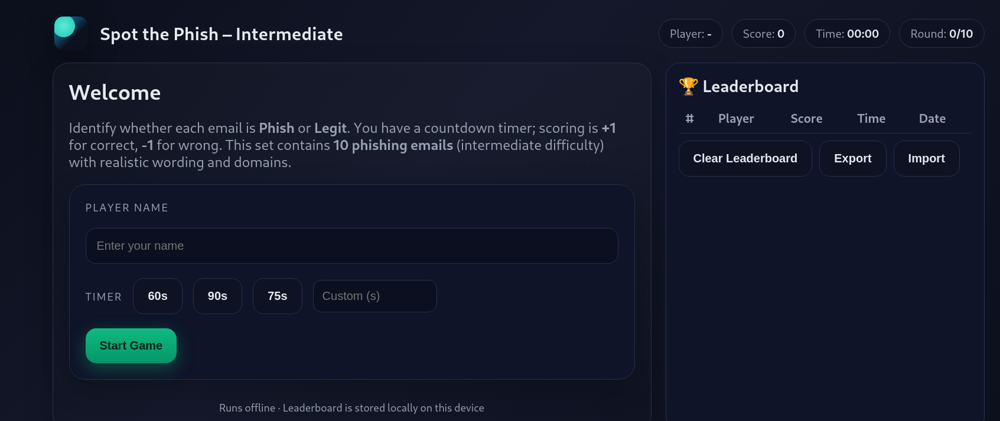

# 🕵️ Spot the Phish – Advanced Cybersecurity Game

An interactive browser-based **phishing email identification game** built entirely with HTML, CSS, and JavaScript.  
Players are presented with **10 tricky phishing emails** and must identify them correctly before the timer runs out.

This game includes:
- **User enrollment system**
- **Persistent leaderboard** (saved locally in the browser, with export/import options)
- **Customizable timer**
- **Clues for each question**
- **Detailed review screen** explaining why each email is phishing
- **Professional cyber-awareness theme**

---

## 🎯 How to Play

1. **Open the `index.html` file** in your browser (no installation required).
2. Enter your **name** to start.
3. Choose a **timer** (60, 75, 90 seconds, or custom).
4. Read each email carefully and **decide if it’s phishing**.
5. For each correct answer: **+1 point**  
   For each wrong answer: **-1 point**
6. Review your mistakes at the end to learn **red flags**.
7. Compete for the **top spot** on the leaderboard!

---

## 🛠 Features

- 🎮 **No server needed** – runs completely offline
- 📋 **Persistent leaderboard** stored in browser `localStorage`
- 🧠 **Clue system** for hints during the game
- 🕒 **Multiple timer settings**
- 📤 **Export / Import leaderboard** (JSON format)
- 📱 Fully responsive – works on desktop and mobile
- 🎨 Professional cybersecurity theme

---

## 📂 Project Structure

```

📁 spot-the-phish/
│
├── index.html       # Main game file
├── style.css        # Game styling
├── script.js        # Game logic
├── README.md        # Project documentation
└── assets/          # (Optional) Images, icons, etc.

````

---

## 🚀 Running Locally

Simply **download** or **clone** the repository and open `index.html` in your web browser:

```bash
git clone https://github.com/yourusername/spot-the-phish.git
cd spot-the-phish
````

Then open:

```
index.html
```

in Chrome, Firefox, Edge, or Safari.

---

## 🏆 Leaderboard System

* Player scores are saved in **localStorage** (persistent even after browser close).
* You can **export** the leaderboard to a `.json` file.
* You can **import** a leaderboard file to restore or share scores.
* You can **clear** the leaderboard anytime.

---

## 📸 Screenshots

> *(Add your screenshots here)*

---

## 📜 License

This project is licensed under the **MIT License** – feel free to use, modify, and share.

---

## 💡 Educational Use

This game is designed for:

* Security awareness training sessions
* Corporate cybersecurity workshops
* School/college cyber literacy programs

It is **not** intended for actual phishing attacks but for **educational simulation purposes** only.

---

